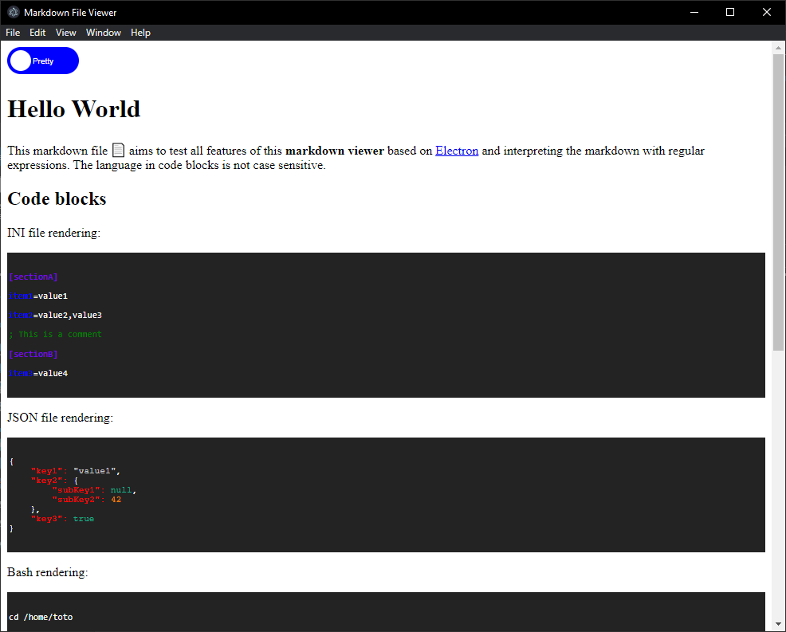

# Simple markdown viewer

[](https://github.com/Naereen/StrapDown.js/blob/master/LICENSE) [](https://github.com/Naereen/Strapdown.js/)

A simple parser and viewer application for markdown files, creating with [Electron](https://www.electronjs.org/).

The following patterns are implemented: title, unordered list, ordered list, code block (particular styles exist for `Bash`, `JSON` and `INI`), link, image.

## Dependencies and install

Electon is a framework which need NodeJS and Chromium for running. One installed, clone this repository and install the Node modules with:

```
npm install
```

## Usage

Run the application in dev mode with the following command:

```
npm start
``` 

The file to read has to be drag and drop in the application window. The checkbox able to switch between the raw and the interpreted content.



---
The same file in raw mode:


## Development

The tables need to be implemented in order to complete a minimal markdown parser... and more to come !

## Author

© 2021-2023 Bruno Verchère

[](https://forthebadge.com)